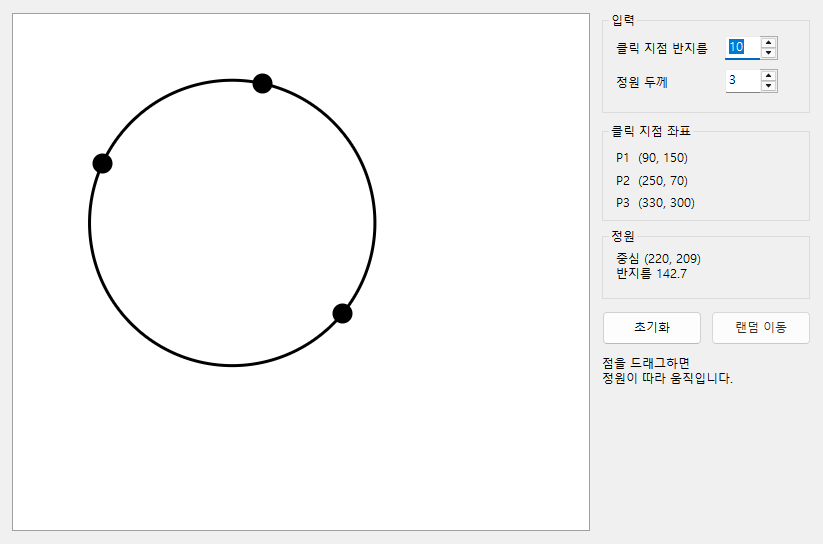
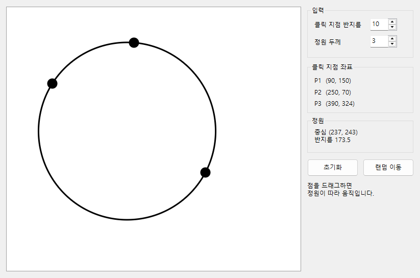
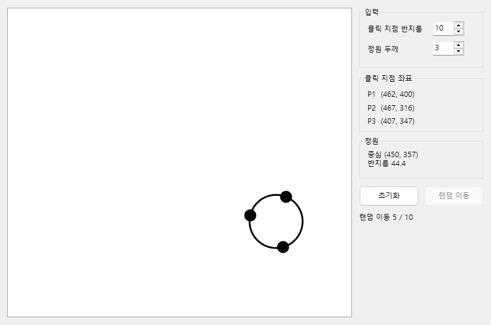

# CircleDrawer — 세 점을 지나는 원 (MFC Dialog)

세 번 클릭한 지점을 모두 지나는 원을 그리고, 드래그와 [랜덤 이동]으로 계속 다시 그리는 MFC 대화상자 프로그램입니다.
모든 원은 **`CImage` 픽셀 메모리에 직접 값을 써서** 그립니다 (`Ellipse`·GDI+·Polygon 류 미사용).

| 세 번 클릭 → 정원 | 드래그 도중 | 랜덤 이동 중 (작업 스레드가 그린 프레임) |
|---|---|---|
|  |  |  |

## 요구사항 대응

| 요구사항 | 구현 | 위치 |
|---|---|---|
| 세 번째 클릭 후 세 점을 모두 지나는 정원 1개 | 외접원 공식. 한 점 기준으로 평행이동해 계산하고, 세 점이 일직선이면 원이 없음을 안내 | `Geometry.cpp` |
| 클릭 지점 원의 반지름을 사용자에게 입력받음 | 스핀 버튼 + 숫자 전용 입력, 1~100 검증, 바꾸면 즉시 다시 그림 | `CircleDrawerDlg.cpp` |
| 각 클릭 지점 원의 중심 좌표를 UI 에 표시 | P1~P3 좌표 + 정원 중심·반지름 표시 | `updateLabels()` |
| 네 번째 클릭부터 클릭 지점 원을 그리지 않음 | 점이 3개면 추가하지 않음 | `CircleScene::addPoint()` |
| 정원 내부는 비우고, 가장자리 두께는 사용자 입력 | 두께만큼의 고리 영역만 칠함, 1~50 검증 | `GrayCanvas::strokeCircle()` |
| 점을 드래그하면, 드래그가 끝날 때까지 정원을 계속 다시 그림 | `SetCapture` + 매 `WM_MOUSEMOVE`마다 다시 그려 `UpdateWindow`로 즉시 표시 | `OnMouseMove()` |
| [초기화]: 모든 내용을 지우고 처음부터 입력 가능 | 실행 중인 이동 스레드를 멈추고(join) 상태·화면 초기화 | `OnBnClickedReset()` |
| [랜덤 이동]: 세 점을 무작위 위치로, 정원도 다시 그림 | 캔버스 안에서, 서로 떨어지고 일직선이 아닌 세 점 생성 | `RandomPointGenerator.cpp` |
| 이동 및 정원 그리기를 **초당 2회, 총 10번**, UI 프리징 없이 **별도 쓰레드**로 | 작업 스레드가 좌표 생성 **+ 정원 그리기**까지 전용 버퍼에서 수행 → UI 스레드는 완성된 프레임을 화면에 옮기기만 함 | `RandomMover.cpp`, `OnBnClickedRandom()` |
| MFC Dialog 기반 | `CDialogEx` | |
| `Ellipse`·GDI+·Polygon 류 금지, 안내 영상 방식으로 그리기 | 8비트 흑백 `CImage`의 `GetBits()`/`GetPitch()` 메모리에 직접 기록 (MFC Study step 2-1~2-3 방식) | `GrayCanvas.cpp` |
| 정원이 그리기 영역을 벗어나도 됨 | 캔버스 안의 부분만 그림 (클리핑) | `GrayCanvas.cpp` |

## 빌드 · 실행

1. Visual Studio 2022 이상과 **"C++ MFC" 구성 요소**가 필요합니다 (Visual Studio Installer → C++를 사용한 데스크톱 개발 → MFC).
2. `CircleDrawer.sln`을 열고 **Release | x64**로 빌드합니다 (`/W4` 경고 0개).
   - 설치된 Visual Studio 의 기본 C++ 도구 집합을 사용합니다 (`$(DefaultPlatformToolset)`). VS 2022/2026 모두 재대상 지정 없이 빌드됩니다.
3. 실행: `x64\Release\CircleDrawer.exe`

## 사용법

1. 왼쪽 캔버스를 세 번 클릭합니다 → 검은 점 3개와, 세 점을 지나는 원이 그려집니다.
2. 점 위에서는 커서가 손 모양이 됩니다. 점을 끌면 원이 실시간으로 따라 움직입니다.
3. 오른쪽에서 **클릭 지점 반지름**과 **정원 두께**를 바꾸면 즉시 반영됩니다.
4. **랜덤 이동**을 누르면 0.5초마다 10번 세 점이 무작위로 이동합니다. 그동안에도 창은 멈추지 않습니다.
5. **초기화**를 누르면 이동 중이더라도 즉시 멈추고 모두 지웁니다.

## 설계

```
CircleDrawerDlg (MFC, UI 스레드) ─ 입력 처리 · 화면 표시
   ├─ CircleScene         상태(점 최대 3개)와 규칙, render()
   │    ├─ Geometry       외접원 계산
   │    └─ GrayCanvas     8비트 픽셀 버퍼에 원·고리를 직접 그리기
   └─ RandomMover         작업 스레드 (std::thread + condition_variable)
        └─ RandomPointGenerator   작업 스레드만 쓰는 난수 생성기

Core(Geometry · GrayCanvas · CircleScene · RandomPointGenerator · RandomMover)는 MFC 에 의존하지 않는다
→ CircleDrawer.Tests 에서 창 없이 단위 테스트한다.
```

### 스레드 설계

[랜덤 이동]의 한 단계(0.5초마다)는 이렇게 진행됩니다.

```
작업 스레드                                   UI 스레드
───────────                                   ─────────
① 새 좌표 3개 생성
② 전용 버퍼에 정원·점 그리기 (완성 프레임)
③ 프레임을 전달 칸에 넣고 (mutex)
④ ::PostMessage(WM_APP_RANDOM_STEP) ───────→ ⑤ 프레임을 꺼내 CImage 에 복사
                                              ⑥ 화면 갱신, 좌표 표시
```

| 원칙 | 이유 |
|---|---|
| 작업 스레드는 **전용 버퍼에만** 그리고, `CImage`·`CWnd` 등 MFC 객체는 만지지 않는다 | Microsoft 문서(*Multithreading: MFC Programming Tips*): MFC 객체는 스레드 안전하지 않고, `CWinThread`가 아닌 스레드에서는 MFC 객체에 접근할 수 없다. 대신 `::PostMessage`로 메인 창에 알리라고 권장한다 |
| `SendMessage`가 아니라 `PostMessage` | UI 스레드가 `join`으로 작업 스레드를 기다리는 동안 작업 스레드가 `SendMessage`로 UI 응답을 기다리면 교착 상태가 된다 |
| 대기는 `Sleep(500)`이 아니라 `condition_variable::wait_until` | [초기화]·창 닫기 때 대기 중인 스레드를 즉시 깨워 종료한다 (500 ms 대기 중 정지 < 100 ms) |
| 각 단계를 `시작 시각 + k × 500 ms`에 실행 | 처리 시간이 누적되어 점점 늦어지지 않는다 (실측 간격 0.48~0.51초) |
| `detach` 대신 `stop()`·소멸자에서 반드시 `join` | 창이 닫힌 뒤 스레드가 해제된 대화상자를 건드리는 일을 원천 차단한다 |
| 세션 번호 | [초기화] 직전에 이미 큐에 들어간 프레임이 초기화 이후 화면에 나타나지 않게 한다 |
| 실행 중 [랜덤 이동] 비활성화 + 중복 시작 거부 | 이동 스레드가 둘 이상 동시에 도는 상황을 막는다 |
| 이동 중 바뀐 반지름·두께는 mutex 로 보호한 설정 사본으로 전달 | 다음 프레임부터 새 설정이 반영된다 |

### 그리기 — 픽셀 메모리 직접 기록

- **안내 영상과 같은 방식**입니다.
  - `CImage::Create(w, -h, 8)` + 흑백 팔레트로 이미지를 만든다 (높이가 음수 = 위에서 아래로 저장).
  - `GetBits()`/`GetPitch()`로 얻은 메모리에 밝기 값을 직접 쓴다.
  - `CImage::Draw()`로 한 번에 화면에 표시한다.
- **클릭 지점 원**: 중심에서의 거리로 원 안의 픽셀인지 판정합니다 (영상의 `isInCircle`과 같은 원리).
- **정원(고리)**: 캔버스 전체를 훑지 않고, **행마다 고리가 지나는 구간만** 계산합니다.
  - 비용이 O(둘레 × 두께)입니다.
  - 세 점이 거의 일직선이라 반지름이 수천만 px 이 되어도 캔버스 안만 계산합니다 (테스트: 반지름 5,000만 px < 200 ms).
- **안티에일리어싱**: 가장자리 픽셀은 원에 걸친 비율만큼 회색으로 칠해 계단 현상을 줄였습니다.
- **깜빡임 없음**: 배경 지우기 없이(`InvalidateRect(…, FALSE)`) 완성된 이미지를 한 번에 복사합니다.

### 입력 · 예외 처리

- 반지름 1~100, 두께 1~50. 범위 밖이거나 숫자가 아니면 적용하지 않고 이전 값을 유지하며 상태 표시줄에 안내합니다.
- 세 점이 일직선이면 원이 존재하지 않으므로 그리지 않고 안내합니다.
- 드래그 중 커서가 캔버스 밖으로 나가면 점은 가장자리에 머뭅니다. Alt+Tab 등으로 마우스 캡처를 잃으면 드래그를 끝냅니다.
- 입력칸에서 Enter 를 눌러도 대화상자가 닫히지 않습니다 (`OnOK` 재정의).
- 캔버스 크기는 대화상자 템플릿의 자리표시 컨트롤에서 얻어, 글꼴·DPI 가 달라도 배치가 어긋나지 않습니다.

## 검증

### 단위 테스트 (26개)

`x64\Release\CircleDrawer.Tests.exe` — 외부 라이브러리 없음, MFC 없이 핵심 로직을 검증합니다.

| 영역 | 내용 |
|---|---|
| 외접원 | 직각삼각형 정답, 무작위 2,000개에서 세 점까지 거리 동일, 점 순서 무관, 일직선·겹친 점 거부, 큰 좌표 정밀도 |
| 그리기 | 채운 넓이 ≈ πr², 고리 두께 = 입력값, 내부 비움, 캔버스 밖 잘림, 거대 반지름 성능, 행 패딩 영역 미침범 |
| 상태 | 최대 3점, 드래그 대상 선택, 초기화 후 재입력, **작업 스레드 프레임 = UI 프레임** (동시에 그려도 픽셀 단위 일치) |
| 스레드 | 10회·간격 정확도, 대기 중 즉시 정지, 중복 실행 방지, 소멸자 join, 콜백 예외 격리 |

### 요구사항 자동 검증 (14항목)

실행 파일을 실제로 조작하고 화면을 캡처해 판정합니다. 실제 마우스는 움직이지 않고 창에 메시지를 보냅니다. 검사 중 프로그램 창이 다른 창들 뒤에 잠시 떴다가 닫힙니다.

```powershell
pip install pillow
python tools\requirements_check.py
```

| # | 항목 | 결과 |
|---|---|---|
| R0 | 금지 API(`Ellipse`·Polygon·GDI+ 등) 미사용 | 통과 (소스 검색) |
| R1 | 세 번째 클릭 후 세 점을 지나는 정원 | 통과 (정답 원 둘레 일치 100%) |
| R2 | 클릭 지점 원 반지름 입력 | 통과 |
| R3 | 중심 좌표 표시 | 통과 |
| R4 | 네 번째 클릭부터 그리지 않음 | 통과 |
| R5 | 정원 내부 비움 + 두께 입력 | 통과 (두께 3 → 3 px, 8 → 8 px) |
| R6 | 드래그 도중 계속 다시 그림 | 통과 (버튼을 떼기 전 3회 캡처 모두 100%) |
| R7 | [초기화] 후 다시 입력 가능 | 통과 |
| R8 | [랜덤 이동] 초당 2회 × 10번, UI 프리징 없음 | 통과 (10회, 간격 0.48~0.51초, UI 정지 0초) |
| R9 | 이동 중 [초기화] → 즉시 정지 | 통과 |
| R10 | [랜덤 이동] 연타해도 한 번만 실행 | 통과 |
| R11 | 잘못된 입력(0, 999) 거부, 프로그램 유지 | 통과 |
| R12 | Enter 키로 창이 닫히지 않음 | 통과 |
| R13 | 이동 중 창을 닫아도 정상 종료 | 통과 (종료 코드 0, 0.03초) |

단위 테스트는 AddressSanitizer(`/fsanitize=address`) 빌드에서도 메모리 오류 없이 통과합니다.

## 한계

- 창 크기 조절은 지원하지 않습니다 (고정 크기 대화상자).
- 여러 모니터 간 DPI 변경(Per-Monitor DPI)은 처리하지 않습니다 (시스템 DPI 인식).
